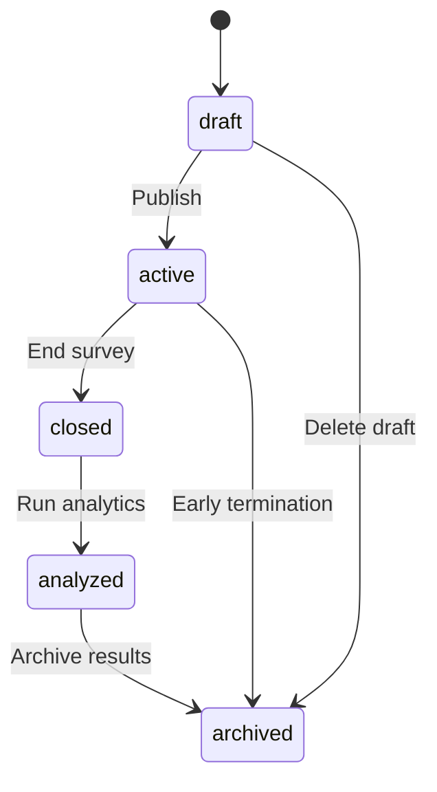

# Bảng Tương Quan: Trạng Thái Khảo Sát vs. Vai Trò Workspace vs. Thông Báo

## Tổng Quan

Hệ thống ALLMTAGS sử dụng **role-based notification filtering** để đảm bảo chỉ những người cần biết mới nhận thông báo phù hợp với trạng thái survey.

---

## 📊 Bảng Tương Quan Chính

| **Survey Status** | **Workspace Roles Nhận Thông Báo** | **Lý Do** | **Use Case** |
|-------------------|-------------------------------------|-----------|--------------|
| **`draft`** | `owner`, `collaborator`, `viewer` | Draft là nội bộ, member không cần biết | "New draft survey created in workspace" |
| **`active`** | `owner`, `collaborator`, `viewer`, `member` | Everyone cần biết để tham gia survey | "New survey available: Please respond!" |
| **`closed`** | `owner`, `collaborator`, `viewer` | Chỉ managers cần biết survey đã đóng | "Survey closed - analyzing results" |
| **`archived`** | `owner`, `collaborator`, `viewer` | Chỉ managers cần biết survey đã archive | "Survey archived for long-term storage" |
| **`analyzed`** | `owner`, `collaborator`, `viewer` | Managers xem kết quả phân tích | "Survey analysis completed" |
| **Default/Other** | `owner`, `collaborator`, `viewer` | Default: chỉ notify managers | Fallback cho status không xác định |

---

## 🎭 Workspace Roles - Định Nghĩa

| **Role** | **Quyền Hạn** | **Nhận Thông Báo Gì** |
|----------|---------------|------------------------|
| **`owner`** | Full control: create, edit, delete, manage members | TẤT CẢ notifications liên quan workspace |
| **`collaborator`** | Create + edit surveys, view analytics | Survey lifecycle events, member updates |
| **`viewer`** | View surveys + results, không edit | Survey status changes, new surveys |
| **`member`** | Chỉ tham gia surveys (respond) | **CHỈ** surveys ở trạng thái `active` |

---

## 🔔 Chi Tiết Logic Notification

### Code Implementation: `notifyWorkspaceMembers`

**Location**: [notification.service.js](file:///d:/NCKH/Backend/src/modules/notifications/service/notification.service.js#L363-L475)

```javascript
async notifyWorkspaceMembers({
  workspaceId,
  type,
  title,
  message,
  surveyStatus = null,  // KEY PARAMETER
  category = 'workspace',
  notifyRoles = ['owner', 'collaborator', 'viewer', 'member']
}) {
  let eligibleRoles = notifyRoles;
  
  // Role-based filtering cho survey notifications
  if (category === 'survey' && surveyStatus) {
    switch (surveyStatus) {
      case 'draft':
        eligibleRoles = ['owner', 'collaborator', 'viewer'];
        break;
      case 'active':
        eligibleRoles = ['owner', 'collaborator', 'viewer', 'member'];
        break;
      case 'closed':
      case 'archived':
        eligibleRoles = ['owner', 'collaborator', 'viewer'];
        break;
      default:
        eligibleRoles = ['owner', 'collaborator', 'viewer'];
    }
  }
  
  // Create notification cho eligible users only
  // ...
}
```

---

## 📋 Survey Status - Định Nghĩa

**Source**: [survey.model.js](file:///d:/NCKH/Backend/src/models/survey.model.js#L43-L46)

```javascript
status: {
  type: DataTypes.ENUM('draft', 'active', 'closed', 'analyzed', 'archived'),
  defaultValue: 'draft',
}
```

### Status Lifecycle



---

## 🎯 Kịch Bản Thực Tế

### Scenario 1: Survey Draft Created

**Context**:
- Workspace: "Marketing Team"
- Action: Owner tạo draft survey "Customer Satisfaction Q4"
- Status: `draft`

**Notifications Sent To**:
| Role | User | Receives? | Why |
|------|------|-----------|-----|
| `owner` | Alice | ✅ Yes | Workspace owner |
| `collaborator` | Bob | ✅ Yes | Can edit surveys |
| `viewer` | Charlie | ✅ Yes | Needs visibility |
| `member` | Dave | ❌ No | Draft không liên quan đến members |

**Notification Content**:
```json
{
  "type": "survey_created",
  "title": "New Draft Survey",
  "message": "Customer Satisfaction Q4 draft created",
  "category": "survey",
  "action_url": "/creator/surveys/123/edit"
}
```

---

### Scenario 2: Survey Activated (Published)

**Context**:
- Survey: "Customer Satisfaction Q4"
- Status: `draft` → `active`

**Notifications Sent To**:
| Role | User | Receives? | Why |
|------|------|-----------|-----|
| `owner` | Alice | ✅ Yes | All notifications |
| `collaborator` | Bob | ✅ Yes | Needs to know survey is live |
| `viewer` | Charlie | ✅ Yes | Can view responses |
| `member` | Dave | ✅ **Yes** | **CAN PARTICIPATE NOW!** |

**Notification Content**:
```json
{
  "type": "survey_published",
  "title": "New Survey Available",
  "message": "Please respond to: Customer Satisfaction Q4",
  "category": "survey",
  "action_url": "/surveys/123/respond",
  "priority": "high"
}
```

---

### Scenario 3: Survey Closed

**Context**:
- Survey: "Customer Satisfaction Q4"
- Status: `active` → `closed`

**Notifications Sent To**:
| Role | User | Receives? | Why |
|------|------|-----------|-----|
| `owner` | Alice | ✅ Yes | Needs to analyze results |
| `collaborator` | Bob | ✅ Yes | Can view results |
| `viewer` | Charlie | ✅ Yes | Can view results |
| `member` | Dave | ❌ No | **No longer relevant** |

**Notification Content**:
```json
{
  "type": "survey_closed",
  "title": "Survey Closed",
  "message": "Customer Satisfaction Q4 is now closed. Analyzing results...",
  "category": "survey",
  "action_url": "/analytics/surveys/123"
}
```

---

## 🔍 Edge Cases & Special Scenarios

### Edge Case 1: Member Promoted to Collaborator

**Situation**: Dave (member) được promote thành `collaborator` khi survey đang ở `draft`

**Kết quả**:
- ✅ Dave **BẮT ĐẦU** nhận notifications về draft surveys
- ✅ Dave có thể edit surveys
- ℹ️ Không có retroactive notifications cho surveys cũ

---

### Edge Case 2: Survey Chuyển Active → Draft (Unpublish)

**Situation**: Owner unpublish survey về draft để sửa

**Kết quả**:
- ❌ Members **NGỪNG** nhận notifications
- ✅ Chỉ managers (`owner`, `collaborator`, `viewer`) được notify về status change
- ⚠️ Members không biết survey đã unpublish (by design)

---

### Edge Case 3: Workspace Without Members

**Situation**: Workspace chỉ có Owner, không có members

**Kết quả**:
- ✅ Owner vẫn nhận notifications
- ℹ️ `notifyWorkspaceMembers` chỉ notify owner
- ✅ System không crash, gracefully handle empty member list

---

## 📐 Matrix: Status × Role × Notification

### Complete Permission Matrix

| Status | Owner | Collaborator | Viewer | Member | Notification Type |
|--------|-------|--------------|--------|--------|-------------------|
| **draft** | ✅ | ✅ | ✅ | ❌ | `survey_created`, `survey_updated` |
| **active** | ✅ | ✅ | ✅ | ✅ | `survey_published`, `reminder` |
| **closed** | ✅ | ✅ | ✅ | ❌ | `survey_closed` |
| **analyzed** | ✅ | ✅ | ✅ | ❌ | `analysis_complete` |
| **archived** | ✅ | ✅ | ✅ | ❌ | `survey_archived` |

---

## 🚀 Implementation Examples

### Example 1: Notify About New Draft Survey

```javascript
await notificationService.notifyWorkspaceMembers({
  workspaceId: 5,
  type: 'survey_created',
  title: 'New Draft Survey',
  message: 'A new survey draft "Employee Engagement" has been created',
  category: 'survey',
  surveyStatus: 'draft',  // KEY: Only managers get this
  relatedSurveyId: 123,
  actionUrl: '/creator/surveys/123/edit',
  actorId: currentUserId
});

// Result: Only owner, collaborator, viewer receive notification
```

---

### Example 2: Notify About Active Survey

```javascript
await notificationService.notifyWorkspaceMembers({
  workspaceId: 5,
  type: 'survey_published',
  title: 'New Survey Available',
  message: 'Please respond to "Employee Engagement" survey',
  category: 'survey',
  surveyStatus: 'active',  // KEY: Everyone gets this
  relatedSurveyId: 123,
  actionUrl: '/surveys/123/respond',
  priority: 'high',
  actorId: currentUserId
});

// Result: ALL workspace members (including role=member) receive notification
```

---

### Example 3: Notify About Survey Closed

```javascript
await notificationService.notifyWorkspaceMembers({
  workspaceId: 5,
  type: 'survey_closed',
  title: 'Survey Closed',
  message: 'Employee Engagement survey is now closed. View results in Analytics.',
  category: 'survey',
  surveyStatus: 'closed',  // KEY: Back to managers only
  relatedSurveyId: 123,
  actionUrl: '/analytics/surveys/123',
  actorId: currentUserId
});

// Result: Only owner, collaborator, viewer receive notification
```

---

## 📊 Statistics & Insights

### Notification Volume by Role (Example Workspace)

**Workspace**: 10 members (1 owner, 2 collaborators, 2 viewers, 5 members)

**Scenario**: 1 survey lifecycle (draft → active → closed)

| Event | Owner | Collab | Viewer | Member | Total |
|-------|-------|--------|--------|--------|-------|
| Draft Created | 1 | 2 | 2 | 0 | **5** |
| Survey Published | 1 | 2 | 2 | 5 | **10** |
| Survey Closed | 1 | 2 | 2 | 0 | **5** |
| **TOTAL** | **3** | **6** | **6** | **5** | **20** |

**Key Insight**: Members chỉ nhận 50% notifications so với managers, reducing noise.

---

## ⚙️ Configuration & Customization

### Override Default Behavior

```javascript
// Force notify all roles (override filtering)
await notificationService.notifyWorkspaceMembers({
  workspaceId: 5,
  type: 'urgent_announcement',
  title: 'Urgent: System Maintenance',
  message: 'All surveys will be offline for 1 hour',
  category: 'system',  // NOT 'survey'
  notifyRoles: ['owner', 'collaborator', 'viewer', 'member']  // Explicit
});

// Result: Everyone gets notification regardless of survey status
```

---

### Exclude Specific Users

```javascript
await notificationService.notifyWorkspaceMembers({
  workspaceId: 5,
  type: 'survey_updated',
  title: 'Survey Updated',
  message: 'Survey has been modified',
  category: 'survey',
  surveyStatus: 'draft',
  excludeUserIds: [currentUserId]  // Don't notify the actor
});

// Result: Managers get notification EXCEPT the user who made the change
```

---

## 🔐 Security Considerations

### Information Disclosure Prevention

**Problem**: Members không được xem draft surveys

**Solution**: 
- ✅ Members **không nhận** notifications về draft
- ✅ `action_url` cho draft surveys → `/creator/surveys/:id/edit` (requires manager role)
- ✅ Frontend kiểm tra role trước khi render notification

---

### Notification Tampering

**Protection**:
- ✅ Backend validates `workspaceId` và user membership
- ✅ Socket.IO rooms: `user_${userId}` ensures only intended recipient receives
- ✅ Frontend validates notification ownership

---

## 📝 Best Practices

### For Backend Developers

1. **Always pass `surveyStatus`** when calling `notifyWorkspaceMembers` cho survey events
2. **Use `category: 'survey'`** to enable role filtering
3. **Set correct `actionUrl`** phù hợp với role (managers → edit page, members → respond page)
4. **Exclude actor** với `excludeUserIds: [actorId]` để tránh self-notification

---

### For Frontend Developers

1. **Check `user.role`** trước khi render notification actions
2. **Validate `action_url`** có phù hợp với current user role
3. **Handle missing permissions** gracefully (redirect to appropriate page)
4. **Filter notifications** client-side nếu cần (double-checking)

---

## 🧪 Testing Checklist

- [ ] Draft survey: Only managers receive notification
- [ ] Active survey: All workspace members receive notification
- [ ] Closed survey: Members stop receiving notifications
- [ ] Role promotion: User immediately receives relevant notifications
- [ ] Role demotion: User stops receiving manager-only notifications
- [ ] Workspace leave: User stops receiving all workspace notifications
- [ ] Survey delete: No notifications sent (or only to managers)

---

## 📚 Related Documentation

- [Notification Service](file:///d:/NCKH/Backend/src/modules/notifications/service/notification.service.js)
- [Survey Model](file:///d:/NCKH/Backend/src/models/survey.model.js)
- [Workspace Exit Consequences](file:///d:/NCKH/docs/workspace_exit_consequences.md)

---

## 🎯 Summary

| Aspect | Key Takeaway |
|--------|--------------|
| **Role Filtering** | Automatic based on `surveyStatus` + `category` |
| **Draft Surveys** | Managers only (`owner`, `collaborator`, `viewer`) |
| **Active Surveys** | Everyone including `member` |
| **Closed/Archived** | Back to managers only |
| **Default Behavior** | Conservative: managers only |
| **Override** | Possible via `notifyRoles` parameter |

**Philosophy**: "Need-to-know basis" - Chỉ notify những người thực sự cần biết information đó.
